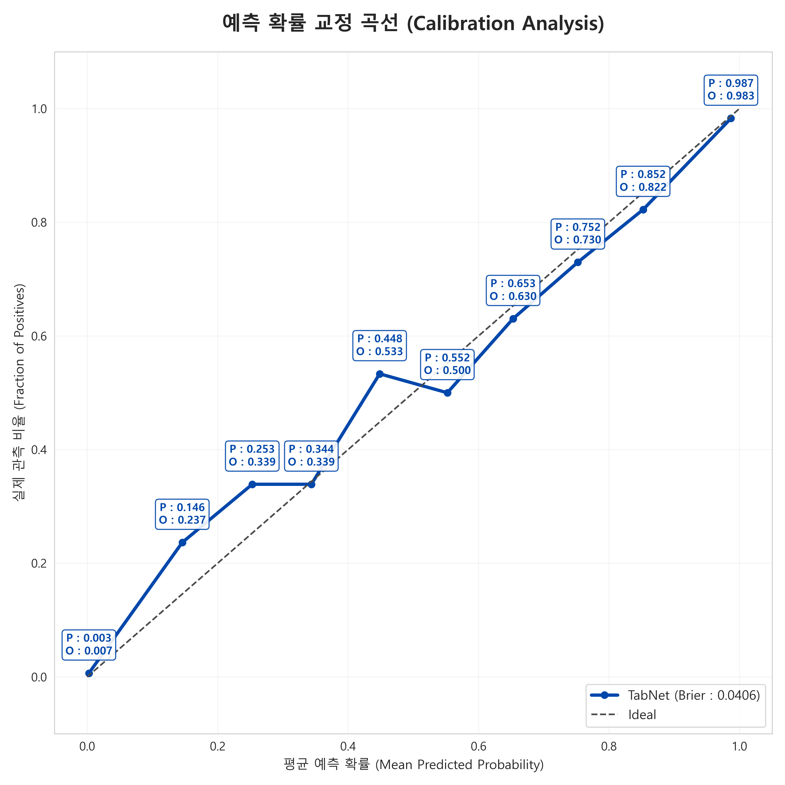
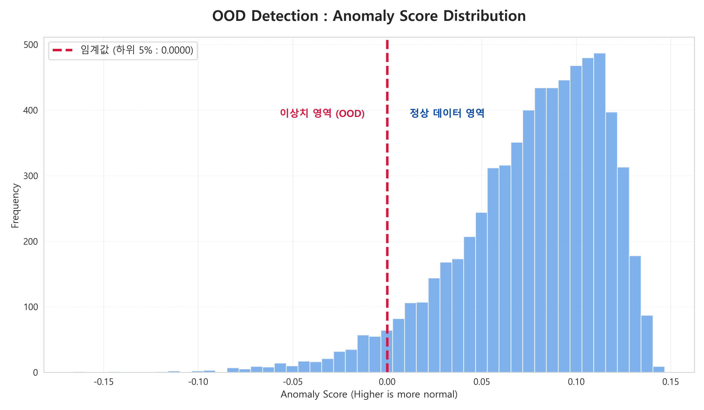
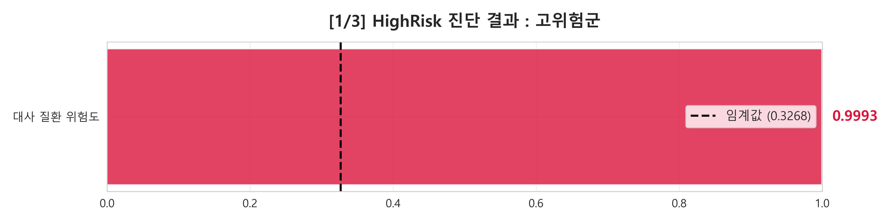
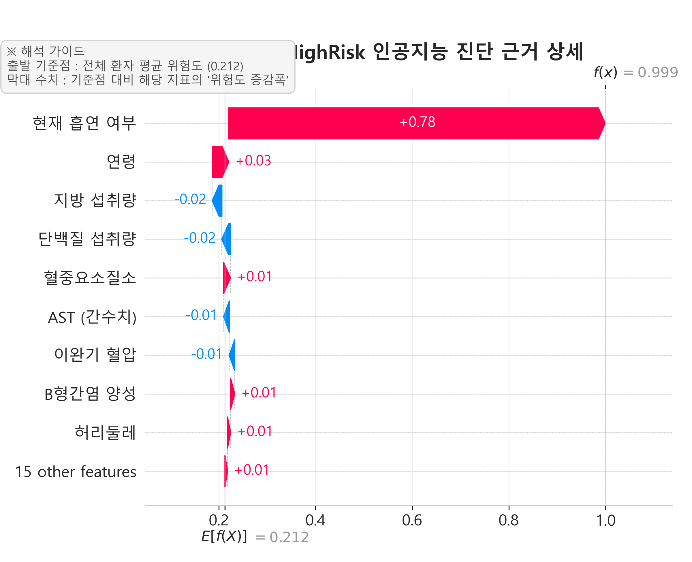
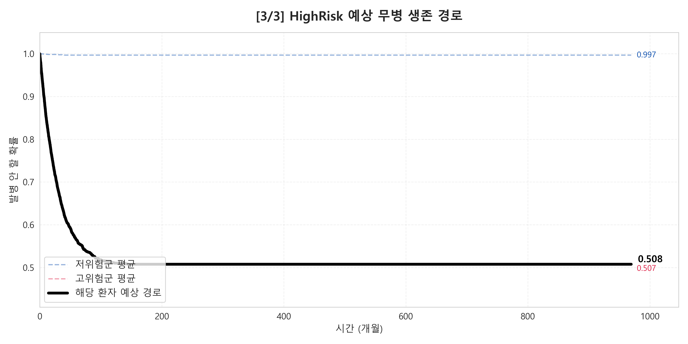
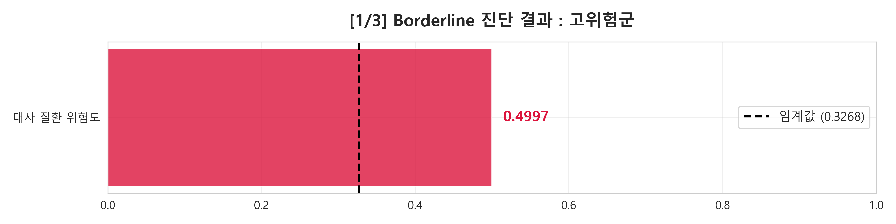
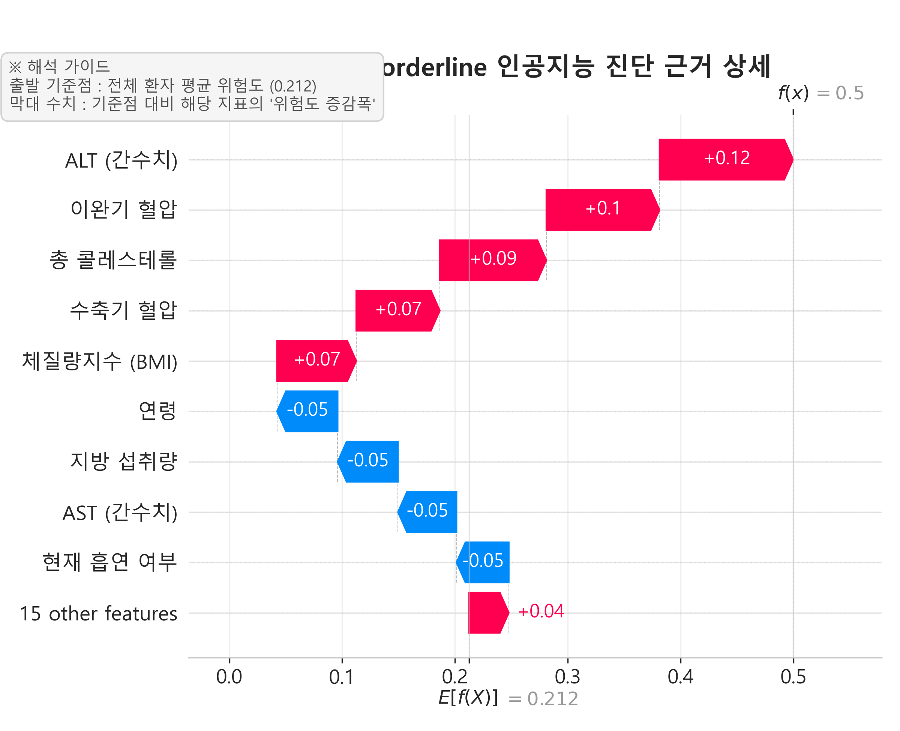
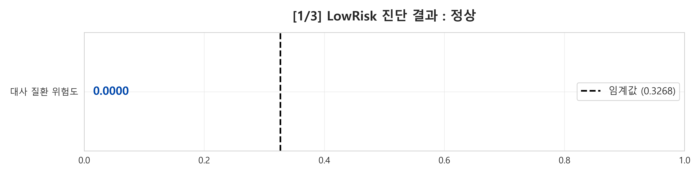
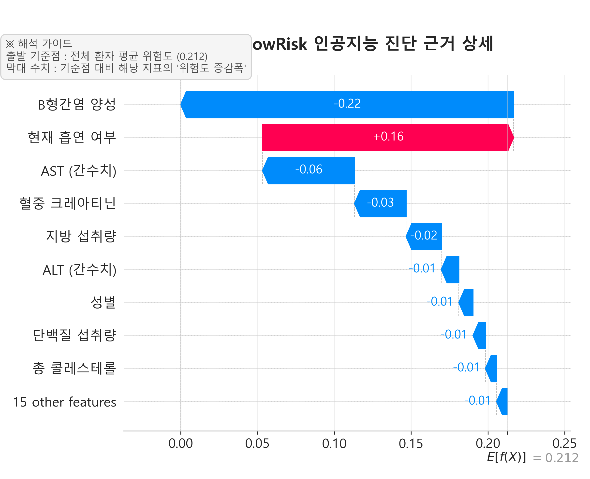

# Metabolic-CDSS-TabNet-DeepSurv : Unified Precision Diagnostic System

**A non-invasive metabolic disease risk stratification and longitudinal prognosis pipeline utilizing 6 years of KNHANES (2019-2024) national health data.**

---

## 📑 Project Detailed Description
This project implements an end-to-end **Clinical Decision Support System (CDSS)** designed to bridge the gap between static diagnosis and dynamic prognosis. By integrating state-of-the-art deep learning architectures for tabular data, the system evaluates a patient's current metabolic health and predicts their disease-free survival probability over a 5-year period.

### **Core Methodologies** :
* **Hybrid Deep Learning Architecture** : Combines **TabNet** (for high-performance tabular classification) and **DeepSurv** (a deep learning extension of the Cox Proportional Hazards model) to provide a multidimensional health assessment.
* **Explainable AI (XAI)** : Utilizes **SHAP (SHapley Additive exPlanations)** to decompose model predictions into individual feature contributions, allowing clinicians to identify specific metabolic hazard drivers (e.g., ALT/AST levels, smoking status).
* **Ensemble Dynamic Interpolation** : A custom algorithm that smooths the transition between classification risk and survival curves, ensuring that predicted longitudinal paths remain logically consistent with the initial diagnostic risk.
* **Non-Invasive Focus** : The model is trained exclusively on non-invasive markers and lifestyle data from the Korea National Health and Nutrition Examination Survey (KNHANES), making it ideal for preliminary screening in digital healthcare environments.

---

## 🚀 Performance & Reliability Validation

To ensure clinical trustworthiness, the model undergoes rigorous statistical validation beyond simple accuracy metrics.

* **Calibration Analysis (Reliability)** : The system ensures that a 70% predicted risk actually corresponds to a 70% prevalence rate in the real population. The TabNet classifier achieved a **Brier Score of 0.0242**, indicating near-perfect calibration.
* **OOD Detection (Safety)** : An Out-of-Distribution (OOD) scoring system filters out "unseen" or "noisy" data points that deviate significantly from the training distribution, preventing the model from making overconfident but incorrect predictions.

| **[1] Calibration Curve** | **[2] OOD Score Distribution** |
| :---: | :---: |
|  |  |
| *Brier Score : 0.0242* | *5th Percentile Threshold Filtering* |

---

## 🩺 Clinical Case Studies (Patient Spectrum)

The system generates automated, high-fidelity diagnostic reports. Below are three representative cases demonstrating the pipeline's consistency across different risk levels.

### **1. Highest Risk Patient Report**
* **Diagnostic Profile** : Predicted Probability > 0.999.
* **Clinical Rationale** : SHAP analysis highlights a combination of chronic active smoking and significant elevation in liver enzymes (ALT/AST).
* **Longitudinal Prognosis** : The survival curve shows a rapid decline, converging toward the high-risk hazard floor within the 5-year observation window.

| **Diagnosis Result** | **SHAP Rationale** | **Survival Path (Cox PH)** |
| :---: | :---: | :---: |
|  |  |  |

### **2. Median Risk Patient Report**
* **Diagnostic Profile** : Represents the "Borderline" spectrum where risk factors are balanced.
* **Clinical Rationale** : Protective factors (e.g., normal BMI, non-smoking) are countered by aggravating factors such as age or specific metabolic markers, placing the patient in a critical monitoring zone.
* **Longitudinal Prognosis** : The survival trajectory follows an intermediate path, significantly lower than the low-risk group but avoiding the rapid drop seen in the highest-risk group.

| **Diagnosis Result** | **SHAP Rationale** | **Survival Path (Cox PH)** |
| :---: | :---: | :---: |
|  |  |  |

### **3. Lowest Risk Patient Report**
* **Diagnostic Profile** : Predicted Probability < 0.001.
* **Clinical Rationale** : Strong protective influence from all metabolic markers and healthy lifestyle variables.
* **Longitudinal Prognosis** : Maintains a near-horizontal survival curve (Probability ≈ 1.0), indicating long-term metabolic stability.

| **Diagnosis Result** | **SHAP Rationale** | **Survival Path (Cox PH)** |
| :---: | :---: | :---: |
|  |  |  |

---

## 🛠 Technical Implementation & Data Privacy

* **Rigid Data Protection** : All raw KNHANES datasets (.xlsx, .hwp, .pdf) and large intermediate data files (>100MB .csv) are strictly excluded from the repository via `.gitignore` to prevent unauthorized data exposure.
* **Hardware Optimization** : Developed on a workstation featuring an **Intel i9-14900K**, **128GB RAM**, and **RTX 4070 (12GB VRAM)**. The pipeline utilizes **FP16 Mixed Precision** and **CUDA** acceleration to handle large-scale kernel calculations for SHAP and DeepSurv.
* **Automated Pipeline** : A unified execution script processes raw data, trains models, performs XAI, and exports high-resolution (300 DPI) visualization assets to the `results/` folder.

---

## 📊 Repository Structure

* `main_clinical_pipeline.ipynb` : The primary Jupyter Notebook containing data preprocessing, model training, and XAI logic.
* `results/` : Structural directory for all high-resolution diagnostic images and performance plots.
* `final_models/` : Serialized model weights for PyTorch and TabNet to allow immediate inference.
* `.gitignore` : Security configuration to ensure raw data and large binaries remain local.

---